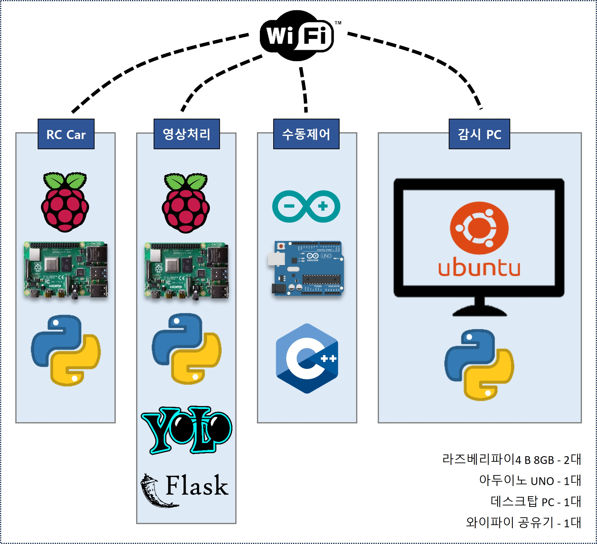

# 3조 : 자율주행 패트롤카 🚓 (Guard Rover)
  - 자율주행 로봇과 객체인식이 적용된 순찰 로봇


<br><br>


## 📁 프로젝트 간략 소개
- ~~자율주행을 통해~~ 구역을 순찰하며 카메라로 침입자를 감지하는 로봇
  - ~~ROS와 2D Lidar 센서를 기반으로 로봇이 이동~~
  - (수정) 장착된 초음파 센서를 통해 장애물을 감지 및 회피하고 구역을 순찰
  - 장착된 카메라를 통해 순찰 중 발견한 사람을 감지하는 역할을 수행

## 💻 프로젝트 내용

### 🎯 목적
- 사람이 커버하기 힘든 공간을 사람을 대신하여 주어진 영역을 순찰하는 로봇

### 🕵️ 문제
- 인구가 줄어감에 따라 사람이 커버하기 힘든 넓은 영역에 대해서 순찰 및 감시를 보조할 수단이 필요함

### 🎣 목표
- a. ~~라이다 센서를 통해 주변을 인식하여 자율주행 가능한 로봇을 구현.~~
- (수정) a-1. 초음파 센서를 기반으로 전면의 장애물을 회피하며 공간을 주행하는 로봇 구현.
- b. 로봇이 카메라를 통해 주행 중 영상을 획득.
- c. 획득한 영상에서 무기를 소지한 사람을 인식하고 사용자에게 알림을 보낸다.

### 🗂️ 파일 구성

```
AI_MiniCar-master/
├── README.md                         # 프로젝트 설명 파일
├── doc/
│   ├── GuardRover_presentation.pdf  # 발표 자료 (PDF)
│   ├── GuardRover_presentation.pptx # 발표 자료 (PPT)
│   └── images/
│       ├── RC-Car_image.jpg         # RC카 결과물 사진
│       ├── system_diagram.jpg       # 시스템 구성도
│       ├── inout_diagram.jpg        # 입출력 구성도
│       └── flowchart_diagram.jpg    # 동작 플로우차트
└── src/
    ├── motor_control/                # 모터 제어 관련 코드
    ├── object_detection/             # 객체 인식 모델 코드
    └── ultrasonic_sensor/            # 초음파 센서 제어 코드
```

## 🛠️ 기술 스택

### **하드웨어**
- **RC카 플랫폼**: 순찰 로봇 기반
- **카메라 모듈**: 영상 획득 및 객체 인식
- **초음파 센서**: 장애물 감지 및 회피
- **모터 및 무선 컨트롤러**: 로봇 구동 및 무선 제어

### **소프트웨어**
- **프레임워크**: 
  - **YOLOv8**: 객체 인식 모델 (흉기 및 사람 감지)
- **프로그래밍 언어**: 
  - **Python**: 모델 트레이닝 및 영상 처리
  - **C/C++**: 센서 및 모터 제어
- **운영체제**:
  - **Linux** (우분투 기반)
- **기타 도구**:
  - **OpenCV**: 영상 처리 라이브러리
  - **PyTorch**: 딥러닝 모델 학습
  
## 🗓 일정


### 🧑‍🤝‍ 팀 구성원
- **Members**
  | **Name** | **Role** |
  |----|----|
  | 권시우 | RC카 조립, 모터 구동부 작업, 객체인식 모델 트레이닝, 작업파일 병합 |
  | 박정우 | RC카 조립, 무선 컨트롤러 작업, 무선 통신 구성 및 고도화 |
  | 조명근 | 트레이닝 모델 파이 적용 및 최적화 작업, 영상처리 최적화 |
  | 박인혁 | ~~ROS2 베이스의 Lidar Sensor & 자율주행 담당~~ <br> (조장) 시스템 설계, ROS검토, 작업파일 병합 및 디버깅, 프로젝트 관리 |

### ⚙️ 하드웨어 및 시스템
- **시스템 구성**


<br><br>

- **입출력 구성**


<br><br>

- **동작 플로우**


<br><br>


## 프리젠테이션 자료
[발표 자료 - PPT](doc/GuardRover_presentation.pptx) <br>
[발표 자료 - PDF](doc/GuardRover_presentation.pdf) <br>
<br>

[🔝맨 위로🔝](#top)
